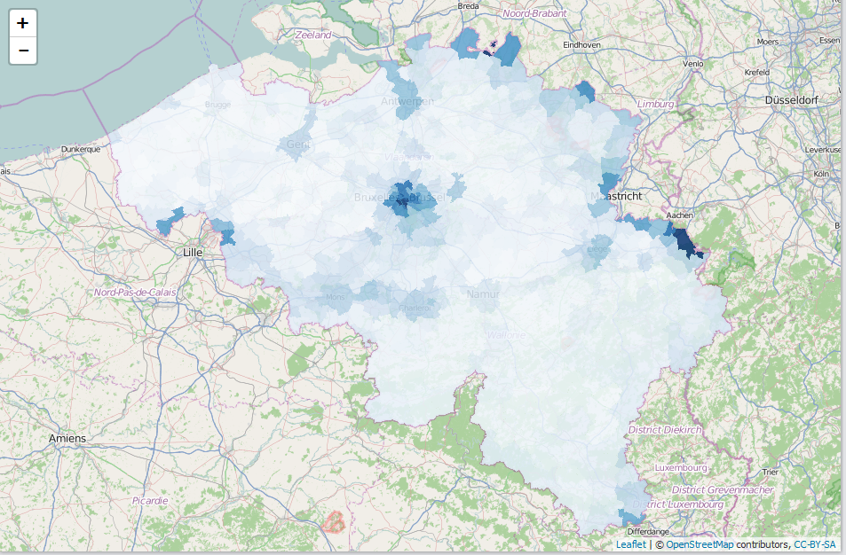
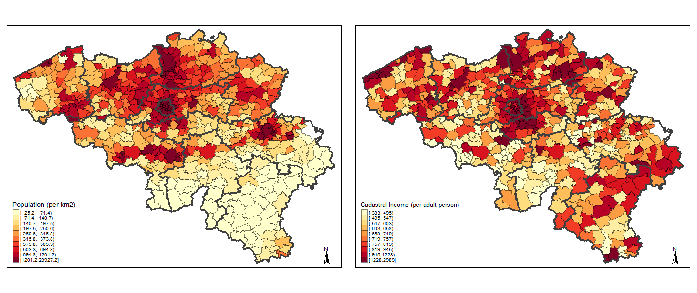
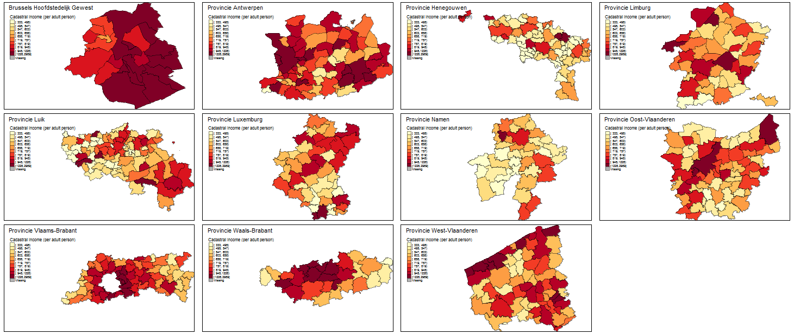

# Statistics and Maps about Belgium

This R package allows R users to easily work with the data made available by the 'Algemene Directie Statistiek - Statistics Belgium', data which is part of the Open Data initiative of the Belgium government (initiative started on 22/10/2015).

It packages the **data** available at http://statbel.fgov.be/nl/statistieken/opendata/home. This data is made available under the **'Licentie open data'** which is compatible with the Creative Commons Attribution 2.0 license https://creativecommons.org/licenses/by/2.0

Next to the data, 2 packages with geospatial data containing **maps** can be used alongside it if you are interested in geographical analysis of Belgium data. Namely package BelgiumMaps.Admin (https://github.com/jwijffels/BelgiumMaps.Admin) and package BelgiumMaps.OpenStreetMap (https://github.com/jwijffels/BelgiumMaps.OpenStreetMap)


## Data
The data of Statistics Belgium covers the topics 'Population', 'Work/Fiscal information', 'Kadaster', the 'Census of 2011' and 'Tools'


The data are collected on 27/10/2015 from the website of http://statbel.fgov.be/nl/statistieken/opendata/home and packaged as an R package. 


## Installation

The R package is currently only available through github. There are no plans to put these packages on CRAN as the data are too big for the CRAN policy and the text is available in UTF-8 instead of ASCII (which is the preferred encoding at CRAN).


To install the latest version from github:
```
devtools::install_github("jwijffels/BelgiumMaps.Admin", build_vignettes = TRUE)
devtools::install_github("jwijffels/StatisticsBelgium", build_vignettes = TRUE)

```
The package StatisticsBelgium is approximately 100Mb in size so **this takes some time to install (+/- 15min)**.




## Documentation of the data sources
The following shows how the data can be accessed and points to documentation of the different datasets. There are 5 main data groups.

### Bevolking
There are 9 datasets available regarding the population. Basically deaths, newborns, population statistics for 2009 up to 2015. 
More information: http://statbel.fgov.be/nl/statistieken/cijfers/arbeid_leven/fisc/index.jsp.
Detailed information about the content of the data can also be found in the **inst/docs/bevolking** folder of the package.
```
library(BelgiumStatistics)
data(TF_BIRTHS) 
data(TF_DEATHS) 
data(TF_SOC_POP_STRUCT_2015) 
data(TF_SOC_POP_STRUCT_2014)
data(TF_SOC_POP_STRUCT_2013) 
data(TF_SOC_POP_STRUCT_2012) 
data(TF_SOC_POP_STRUCT_2011) 
data(TF_SOC_POP_STRUCT_2010) 
data(TF_SOC_POP_STRUCT_2019) 
```

### Werk
There is 1 dataset available regarding fiscal revenues from 2005 up to 2015. 
More information: http://statbel.fgov.be/nl/statistieken/cijfers/arbeid_leven/fisc/index.jsp
Detailed information about the content of the data can also be found in the **inst/docs/werk** folder of the package.
```
library(BelgiumStatistics)
data(TF_PSNL_INC_TAX_MUNTY) 
```

### Leefmilieu
There are 30 datasets available regarding the land occupation. From the periods 1983 up to 2015. 
More information: http://statbel.fgov.be/nl/statistieken/cijfers/leefmilieu/geo/bodembezetting_kadaster/
Detailed information about the content of the data can also be found in the **inst/docs/leefmilieu** folder of the package.
```
library(BelgiumStatistics)
data(TF_EAE_LAND_OCCUPTN_2015) 
data(TF_EAE_LAND_OCCUPTN_2014) 
data(TF_EAE_LAND_OCCUPTN_2013) 
data(TF_EAE_LAND_OCCUPTN_2012) 
data(TF_EAE_LAND_OCCUPTN_2011) 
data(TF_EAE_LAND_OCCUPTN_2010) 
data(TF_EAE_LAND_OCCUPTN_2009) 
data(TF_EAE_LAND_OCCUPTN_2008) 
data(TF_EAE_LAND_OCCUPTN_2007) 
data(TF_EAE_LAND_OCCUPTN_2005) 
data(TF_EAE_LAND_OCCUPTN_2004) 
data(TF_EAE_LAND_OCCUPTN_2002) 
data(TF_EAE_LAND_OCCUPTN_2001) 
data(TF_EAE_LAND_OCCUPTN_2000) 
data(TF_EAE_LAND_OCCUPTN_1999) 
data(TF_EAE_LAND_OCCUPTN_1998) 
data(TF_EAE_LAND_OCCUPTN_1997) 
data(TF_EAE_LAND_OCCUPTN_1996) 
data(TF_EAE_LAND_OCCUPTN_1995) 
data(TF_EAE_LAND_OCCUPTN_1994) 
data(TF_EAE_LAND_OCCUPTN_1993) 
data(TF_EAE_LAND_OCCUPTN_1991) 
data(TF_EAE_LAND_OCCUPTN_1990) 
data(TF_EAE_LAND_OCCUPTN_1989) 
data(TF_EAE_LAND_OCCUPTN_1988) 
data(TF_EAE_LAND_OCCUPTN_1987) 
data(TF_EAE_LAND_OCCUPTN_1986) 
data(TF_EAE_LAND_OCCUPTN_1985) 
data(TF_EAE_LAND_OCCUPTN_1984) 
data(TF_EAE_LAND_OCCUPTN_1983) 
```


### Census 2011
There are 57 datasets available regarding the census in 2011. Grouped by different levels of aggregation.
More information: More information http://www.census2011.be/index_nl.html
Detailed information about the content of the data can also be found in the **inst/docs/census2011** folder of the package.
```
library(BelgiumStatistics)
data(TF_CENSUS_2011_HC01_L) 
data(TF_CENSUS_2011_HC02_L) 
data(TF_CENSUS_2011_HC03_L) 
data(TF_CENSUS_2011_HC04_L) 
data(TF_CENSUS_2011_HC06_L) 
data(TF_CENSUS_2011_HC07_L) 
data(TF_CENSUS_2011_HC08_L) 
data(TF_CENSUS_2011_HC09_L) 
data(TF_CENSUS_2011_HC10_L) 
data(TF_CENSUS_2011_HC11_L) 
data(TF_CENSUS_2011_HC12_L) 
data(TF_CENSUS_2011_HC13_L) 
data(TF_CENSUS_2011_HC14_L) 
data(TF_CENSUS_2011_HC15_L) 
data(TF_CENSUS_2011_HC16_L) 
data(TF_CENSUS_2011_HC17_L) 
data(TF_CENSUS_2011_HC18_L) 
data(TF_CENSUS_2011_HC19_L) 
data(TF_CENSUS_2011_HC20_L) 
data(TF_CENSUS_2011_HC21_L) 
data(TF_CENSUS_2011_HC22_L) 
data(TF_CENSUS_2011_HC23_L) 
data(TF_CENSUS_2011_HC24_L) 
data(TF_CENSUS_2011_HC25_L) 
data(TF_CENSUS_2011_HC26_L) 
data(TF_CENSUS_2011_HC27_L) 
data(TF_CENSUS_2011_HC28_L) 
data(TF_CENSUS_2011_HC29_L) 
data(TF_CENSUS_2011_HC30_L) 
data(TF_CENSUS_2011_HC31_L) 
data(TF_CENSUS_2011_HC32_L) 
data(TF_CENSUS_2011_HC33_L) 
data(TF_CENSUS_2011_HC34_L) 
data(TF_CENSUS_2011_HC35_L) 
data(TF_CENSUS_2011_HC36_L) 
data(TF_CENSUS_2011_HC37_L) 
data(TF_CENSUS_2011_HC38_L) 
data(TF_CENSUS_2011_HC39_L) 
data(TF_CENSUS_2011_HC40_L) 
data(TF_CENSUS_2011_HC41_L) 
data(TF_CENSUS_2011_HC42_L) 
data(TF_CENSUS_2011_HC43_L) 
data(TF_CENSUS_2011_HC44_L) 
data(TF_CENSUS_2011_HC45_L) 
data(TF_CENSUS_2011_HC46_L) 
data(TF_CENSUS_2011_HC47_L) 
data(TF_CENSUS_2011_HC48_L) 
data(TF_CENSUS_2011_HC50_L) 
data(TF_CENSUS_2011_HC51_L) 
data(TF_CENSUS_2011_HC52_L) 
data(TF_CENSUS_2011_HC53_L) 
data(TF_CENSUS_2011_HC54_L) 
data(TF_CENSUS_2011_HC55_L) 
data(TF_CENSUS_2011_HC56_L) 
data(TF_CENSUS_2011_HC58_L) 
data(TF_CENSUS_2011_HC59_L) 
data(TF_CENSUS_2011_HC60_L) 
```


### Tools
There is 1 dataset available regarding codes of occupations. 
More information: http://www.ilo.org/public/english/bureau/stat/isco/index.htm
Detailed information about the content of the data can also be found in the **inst/docs/tools** folder of the package.
```
library(BelgiumStatistics)
data(TU_ISCO_2008)
```


## Visualisation

### Package BelgiumMaps.Admin

The BelgiumStatistics package integrates nicely with the BelgiumMaps.Admin package which can be found here: https://github.com/jwijffels/BelgiumMaps.Admin
That package contains administrative boundaries which were extracted from OpenStreetMap. These maps can be linked based on the INS code which is available in the data of StatisticsBelgium as well as the maps from package BelgiumMaps.Admin.

This can be as simple as:

```
library(BelgiumStatistics)
library(BelgiumMaps.Admin)
library(data.table)
library(sp)
library(leaflet)

data(BE_OSM_ADMIN, package = "BelgiumMaps.Admin")
data(TF_SOC_POP_STRUCT_2015, package = "BelgiumStatistics")

x <- as.data.table(TF_SOC_POP_STRUCT_2015)
x <- x[, list(Females = 100 * sum(MS_POPULATION[CD_SEX == "F"]) / sum(MS_POPULATION)),
       by = list(CD_MUNTY_REFNIS, TX_MUNTY_DESCR_NL, TX_MUNTY_DESCR_FR)]

mymap <- merge(BE_OSM_ADMIN, x, by.x = "tag.ref.ins", by.y = "CD_MUNTY_REFNIS", all.x=FALSE, all.y=FALSE)
pal <- colorNumeric(palette = "Blues", domain = mymap$Females)
leaflet(mymap) %>%
  addTiles() %>%
  addPolygons(stroke = FALSE, smoothFactor = 0.2, fillOpacity = 0.85, color = ~pal(Females)) %>%
  addPopups(lng = 4.366354, lat = 50.86619, popup="BNOSAC offices<br/>www.bnosac.be")
```

Or the data can also easily be used to make thematic plots.
The example code below shows a basic thematic plot of the population and the kadaster.



```
require(BelgiumStatistics)
require(BelgiumMaps.Admin)
require(data.table)
require(sp)
require(tmap) ## using the package from https://github.com/mtennekes/tmap
require(Hmisc)
data(TF_SOC_POP_STRUCT_2015, package = "BelgiumStatistics")
data(TF_EAE_LAND_OCCUPTN_2015, package = "BelgiumStatistics")
data(BE_OSM_ADMIN, package = "BelgiumMaps.Admin")

## Get some statistics about the municipalities
population <- as.data.table(TF_SOC_POP_STRUCT_2015)
population <- population[, list(POPULATION = sum(MS_POPULATION),
                                POPULATION.ADULT = sum(MS_POPULATION[CD_AGE >= 18])), 
                by = list(CD_MUNTY_REFNIS, TX_MUNTY_DESCR_NL, TX_ADM_DSTR_DESCR_NL, TX_PROV_DESCR_NL, TX_RGN_DESCR_NL)]
population$TX_PROV_DESCR_NL <- ifelse(is.na(population$TX_PROV_DESCR_NL), population$TX_RGN_DESCR_NL, population$TX_PROV_DESCR_NL)

surface <- as.data.table(TF_EAE_LAND_OCCUPTN_2015)
surface <- surface[, list(SURFACE_HECTARE = sum(MS_TOT_SUR),
                          KADASTRAAL_INKOMEN = sum(MS_TOT_CDSTRL_INC)), by = list(CD_MUNTY_REFNIS)]
## Join population stats with kadaster data  
x <- merge(population, surface, by = "CD_MUNTY_REFNIS")

## Join the maps with the data based on the INS code
mymap <- merge(BE_OSM_ADMIN, x, by.x = "tag.ref.ins", by.y = "CD_MUNTY_REFNIS", all.x=FALSE, all.y=FALSE)
mymap$SURFACE_SQUARE_KM <- mymap$SURFACE_HECTARE / 100
mymap$POPULATION.DENSITY <- mymap$POPULATION / mymap$SURFACE_SQUARE_KM
mymap$KADASTRAAL.INKOMEN.PERADULTPERSON <- mymap$KADASTRAAL_INKOMEN / mymap$POPULATION.ADULT
mymap$POPULATION.DENSITY.GRP <- cut2(mymap$POPULATION.DENSITY, g = 10)
mymap$KADASTRAAL.INKOMEN.PERADULTPERSON.GRP <- cut2(mymap$KADASTRAAL.INKOMEN.PERADULTPERSON, g = 10)

## Take gemeenten + provincies
gemeenten <- subset(mymap, !is.na(POPULATION) & admin.level %in% c("8"))
provincies <- subset(BE_OSM_ADMIN, admin.level == "6")

## Thematic chloropethr maps
tm_shape(gemeenten) +
  tm_fill(col=c("POPULATION.DENSITY.GRP", "KADASTRAAL.INKOMEN.PERADULTPERSON.GRP"), 
          title=c("Population (per km2)", "Cadastral Income (per adult person)"), palette = "YlOrRd") +
  tm_borders("black", alpha = .5) + 
  tm_shape(provincies, lwd = 2) + tm_borders("grey25", lwd = 4) +
  tm_compass(position = c("right", "bottom")) 

tm_shape(gemeenten) +
  tm_fill(col="KADASTRAAL.INKOMEN.PERADULTPERSON.GRP", title="Cadastral Income (per adult person)", palette = "YlOrRd") +
  tm_borders("black", alpha=.5) + 
  tm_facets("TX_PROV_DESCR_NL", free.coords=TRUE) +
  tm_format_Europe_wide(inner.margins = c(0, 0.3, 0, 0))
```




### Package BelgiumMaps.OpenStreetMap

This package contains geospatial data of landuse, natural, places, points, railways, roads and waterways, extracted from OpenStreetMap. https://github.com/jwijffels/BelgiumMaps.OpenStreetMap
The data can be used to extend the plotting.

